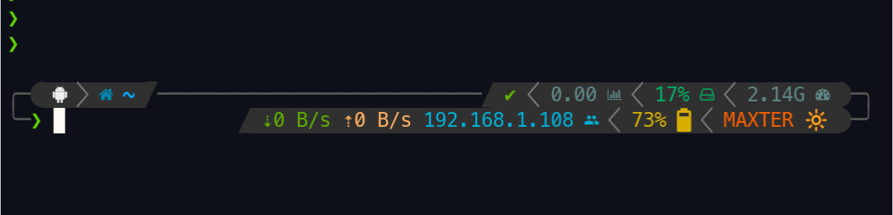

# MAXTER - 🚀 For Termux 

MAXTER is your doorway to a personalized and powerful terminal experience on Termux! 🐚 Inspired by fish shell and crafted for zsh, MAXTER offers a swift setup for stunning terminal themes.

# MAXTER Installation

To install MAXTER on your Termux, run:

```bash
sh -c "$(curl -fsSL https://raw.githubusercontent.com/mahendraplus/MAXTER/Max/install.sh)"

```
# Screenshot 
<p align="center">
  
</p>

<h3 align="center"> MaxTer V1.0</h3>

<h2 About the Author/>

Hello, I'm Max (Mahendra) 👋, a passionate coder with a flair for creating exceptional terminal environments. With a background in sports and ethical hacking, I've navigated through the tech landscape, collaborating with renowned companies, including Internet service providers. MAXTER is my brainchild, a simple yet potent project designed to enhance my students' terminal experiences.

## GitHub Coder Appreciation 🙌

Big shoutout to the amazing GitHub coder, [GitHub Coder](https://github.com/github-coder) 🌟! Their brilliance and contributions have significantly influenced and shaped MAXTER.

Dive into the vibrant MAXTER community, explore, contribute, and embark on an exciting terminal adventure! 🚀✨

---

[](https://raw.githubusercontent.com/mahendraplus/MAXTER/Max/install.sh)
